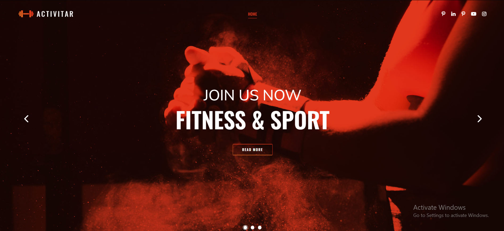

# clone project

git clone https://github.com/ArfinDBstudio/Fitness_App.git

# Navigate to folder in terminal
 cd fitnesswebapp

 # and type below commands
 * pip install pipenv 
 * pipenv install django
 * pip install nltk
 * pipenv shell
 * py manage.py runserver
  # To perform above cmd you should have python on your pc which should be configure in environmental variable
# images

